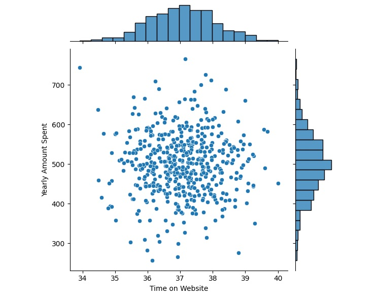
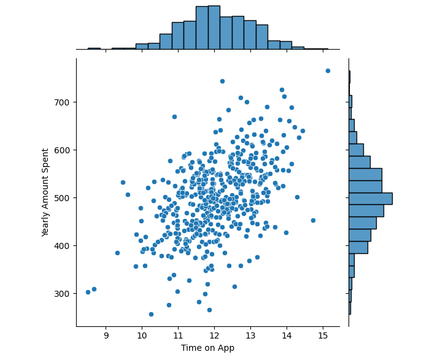
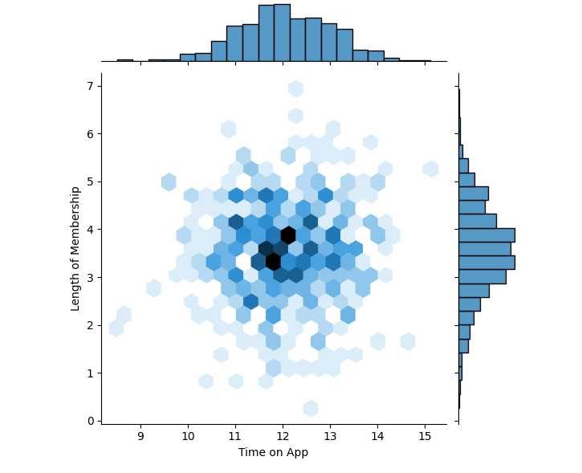
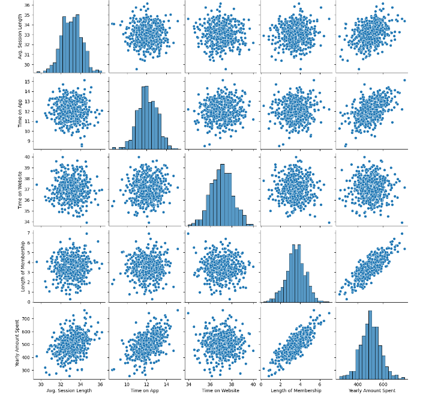
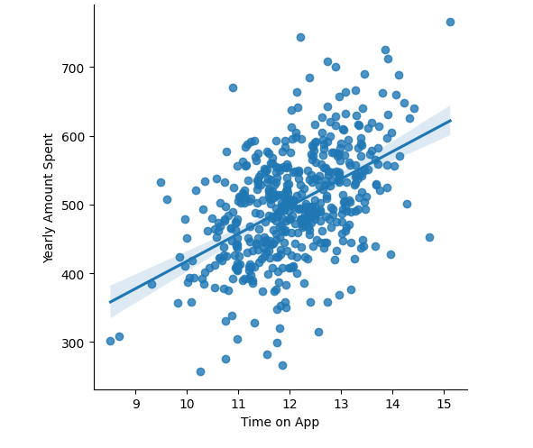
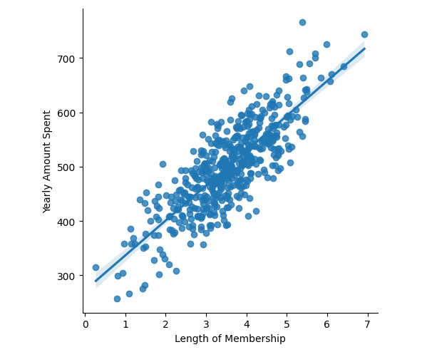
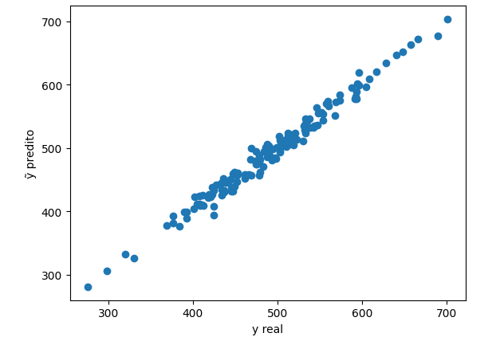
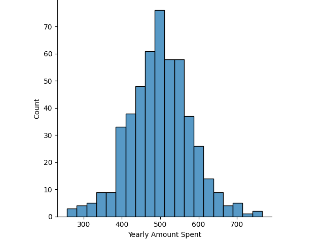
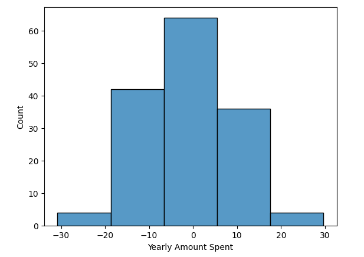
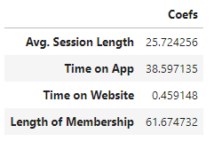

# Projeto de Machine Learning - Regressão Linear

Este projeto realiza uma análise em uma empresa de comércio eletrônico com experiência na venda de roupas online e consultoria em estilo e vestuário.

# Introdução

Os clientes frequentemente buscam sessões personalizadas com estilistas e têm a opção de realizar compras através de um aplicativo móvel ou do site da empresa.

A empresa enfrenta um dilema estratégico crucial: determinar onde concentrar os recursos para otimizar a experiência do usuário, seja no aplicativo móvel ou no site. Com recursos limitados disponíveis para investimentos, minha função é realizar uma análise robusta para orientar essa decisão estratégica.

# Descrição do Dataset:

Conjunto de dados: [disponível no Kaggle](https://www.kaggle.com/srolka/ecommerce-customers). 

As variáveis:

* `Avg. Session Length`: Tempo médio gasto em consultorias de estilo na loja.
* `Time on App`: Média de minutos gastos utilizando o aplicativo.
* `Time on Website`: Média de minutos navegados no site.
* `Lenght of Membership`: Tempo decorrido desde a adesão como membro.
* `Yearly Amount Spent`: Valor despendido pelo cliente anualmente.

# Etapas do Projeto:

* **Conhecendo o Dataset**: Importação das bibliotecas necessárias e leitura do conjunto de dados.
* **Análises Preliminares**: Exploração inicial dos dados, com o objetivo de responder perguntas e obter insights importantes.
* **Visualização dos Dados**: Utilização de gráficos de boxplot e histograma para entender a distribuição dos dados e identificar possíveis outliers. Também plotagem de gráficos de dispersão para observar as relações entre as variáveis.
* **Estimando um Modelo de Regressão Linear**: Divisão dos dados em conjuntos de treino e teste. Também instanciação do modelo de regressão linear e ajuste aos dados de treino.
* **Previsões Pontuais**: Geração de previsões para dados de teste e exemplos específicos usando o modelo treinado.

# Análise Exploratória dos Dados

**Qual é a correlação entre o tempo de navegação no site e o montante gasto anualmente?**

- Não há uma relação linear entre o tempo gasto no website e a quantidade gasta anualmente. Se houvesse uma relação linear, os dados estariam projetados em uma reta, tanto crescendo quanto decrescendo.
- Pessoas que passam necesseriamente mais tempo no website não gastam mais

---

**Qual é a correlação entre o tempo de utilização do aplicativo e o valor gasto anualmente?**

- Existe uma relação linear, embora não seja muito forte. A variância dos dados de tempo de uso do aplicativo é significativamente maior em comparação com o valor gasto anualmente.
- Pessoas que passam mais tempo no aplicativo tem uma tendência para gastar mais.

---

**Os usuários do aplicativo têm uma maior longevidade como clientes ou não?**

- No Eixo X, os usuário têm um tempo no aplicativo variando entre 10 e 14 horas. A maioria dos usuários está em torno de 12 horas no aplicativo, conforme indicado pelo pico no histograma superior.
- No Eixo Y a duração varia entre 0 e 7 anos. A maioria dos usuários tem entre 3 e 5 anos anos de associação.
- O gráfico mostra uma concentração maior de usuários na interseção de aproximadamente 12 horas no aplicativo e entre entre 3 e 5 anos de associação.
- Os usuários do aplicativo tendem a ter uma longevidade moderada como clientes.

---

**Quais variáveis conseguimos identificar como explicativas ou de maior impacto nos gastos anuais de uma pessoa?**

- As variáveis "Length of Membership" e "Time on App" possuem o maior impacto nos gastos anuais de uma pessoa. A ''Avg. Session Length" também contribui, mas em menor grau, e "Time on Website" tem o menor impacto entre as variáveis.

---

**Como seria formulado um modelo linear que relaciona o tempo de uso do aplicativo com o valor gasto?**

---

**Como seria formulado um modelo linear que relaciona o tempo de associação dos membros com o valor gasto?**

# Desenvolvimento de um modelo incorporando todas as variáveis disponíveis

**Criando um gráfico de dispersão (scatter plot) para comparar os valores reais de teste com os valores preditos pelo modelo**

# Avaliação do Modelo

- **Métricas de Avaliação do Modelo:**

- **Erro Absoluto Médio (MAE):** O MAE de 8,42 indica que, em média, o modelo está errando em cerca de 8,42 unidades na previsão do gasto anual. Dado que o intervalo de gastos anuais é de 400 a 600, esse erro é relativamente pequeno. Por exemplo, se um cliente gastar R$ 400, o modelo prevê que ele gastará entre R$ 392 e R$ 408. Esse nível de erro é aceitável, considerando a escala dos dados.
- **Erro Quadrático Médio (MSE):** O MSE de 103 é uma métrica adequada para avaliar o desempenho do modelo. Ele mede o erro quadrático médio entre as previsões e os valores reais. Quanto menor o MSE, melhor o desempenho do modelo.
- **Raiz do Erro Quadrático Médio (RMSE):** O RMSE de 10 é a raiz quadrada do MSE. Ele fornece uma estimativa do erro médio absoluto em relação aos valores reais. Novamente, considerando a escala dos dados, um RMSE de 10 é razoável.
- **Coeficiente de Determinação (R²):** O valor de 0,98 para R² é excelente. Ele indica que o modelo explica cerca de 98% da variância nos dados. Isso significa que o modelo está se ajustando bem aos dados observados.

# Conclusões finais

- O modelo linear foi capaz de resolver o problema?

- Podemos observar no histograma que a maioria dos erros está concentrada entre -10 e 10. O modelo apresenta um erro consideravelmente bom. No entanto, ao analisarmos a escala de gastos, que varia entre 400 e 600, percebemos que o modelo está cometendo um erro de 10. Portanto, podemos considerar esse erro como aceitável.

---

**Insights**

- Cada aumento de uma unidade no tempo médio das sessões de consultoria com o estilista resulta em um aumento de 25.72 dólares na receita anual.
- Cada minuto gasto em média no aplicativo aumenta a receita anual em 38.59 dólares.
- O tempo no site tem um impacto mínimo na receita anual.
- A empresa obtém mais receita ao fidelizar seus clientes; cada unidade de aumento na fidelização resulta em um aumento de 61.67 dólares na receita anual.

